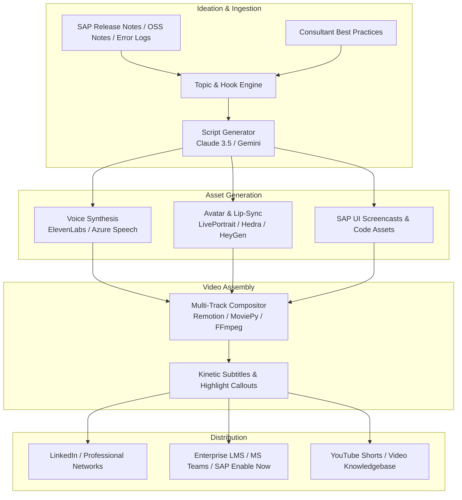

# Enterprise AI Microlearning Engine (SAP & B2B Edition)

> **Autonomous AI-SME (Subject Matter Expert) Pipeline for High-Retention Microlearning, LinkedIn Thought Leadership, and Enterprise Training.**

[](LICENSE)
[](https://www.python.org/downloads/)
[](docs/ARCHITECTURE.md)

---

## 💡 Executive Concept & Vision

Traditional enterprise software training (especially in complex ecosystems like **SAP S/4HANA, BTP, Fiori, and ABAP Cloud**) suffers from:
* **Information Overload:** 200-page dry PDF manuals, static documentation, and hour-long webinar recordings that employees and consultants rarely finish.
* **Slow Content Production:** High production costs for instructional designers, video editors, and on-camera subject matter experts.
* **Low Retention:** Lack of hook psychology and dynamic visual framing that drives modern knowledge retention.

### From "Faceless Influencer" to "Enterprise AI-SME"
Borrowing the viral mechanics of modern AI content pipelines (consistent character avatars, 3-second retention hooks, dynamic zoom cuts, kinetic typography), this engine redirects those mechanics toward **high-value B2B microlearning**:
* **60–90 second hyper-focused video nuggets** solving real enterprise pain points (e.g., debugging SAP error codes, Clean Core extensibility rules, Fiori UX shortcuts).
* **Consistent AI-SME Personas** acting as virtual corporate mentors (The Solution Architect, The Fiori Developer, The Supply Chain Specialist).
* **Multi-Layered Layout:** Combines talking AI avatars with split-screen SAP GUI/Fiori screencasts, annotated code blocks, and animated UI callouts.
* **Dual Distribution:**
  1. **External:** Automated publishing to LinkedIn, YouTube Shorts, and X for B2B consulting lead generation and thought leadership.
  2. **Internal:** Direct packaging into enterprise LMS (SCORM/xAPI), Microsoft Teams learning channels, and intranet onboarding hubs.

---

## 🏛️ System Architecture Overview



For the complete technical breakdown, see [docs/ARCHITECTURE.md](docs/ARCHITECTURE.md).

---

## 🎭 Persona Archetypes for Enterprise SAP

| Persona | Domain / Niche | Content Focus | Target Audience |
| :--- | :--- | :--- | :--- |
| **Marcus Vance** | SAP Enterprise Architect | S/4HANA Migration, Clean Core, BTP Architecture, Cloud Integration | CIOs, Enterprise Architects, IT Directors |
| **Elena Rostova** | Fiori & ABAP Cloud Dev | Fiori Elements, CDS Views, RAP (RESTful ABAP), VS Code extensions | Developers, Technical Consultants |
| **David Chen** | Supply Chain & Logistics | SAP MM, SD, EWM transaction tips, troubleshooting inventory blocks | Functional Consultants, Supply Chain Ops |

---

## 📂 Repository Structure

```
├── README.md                          # Project overview and executive vision
├── docs/
│   ├── ARCHITECTURE.md                # System architecture, schemas, and pipeline specs
│   ├── SAP_MICROLEARNING_STRATEGY.md  # Content framework, hook formulas, and topic roadmap
│   ├── TECH_STACK.md                  # Comprehensive tool and library choices
│   └── ROADMAP.md                     # Phased milestones from MVP to Enterprise Automation
├── configs/
│   ├── personas/                      # Persona voice, appearance, and prompt configs
│   │   ├── sap_architect.yaml
│   │   ├── fiori_dev.yaml
│   │   └── erp_functional_consultant.yaml
│   └── templates/                     # 60s microlearning script templates
│       └── bite_size_tip_60s.yaml
├── src/
│   ├── core/                          # Configuration, Pydantic schemas, and repositories
│   │   ├── config.py
│   │   ├── models.py
│   │   └── repositories.py            # Pluggable Local JSON & Cloud Firestore storage
│   ├── pipeline/                      # Core processing pipeline
│   │   ├── ideation.py                # Script and hook generation (Claude/Gemini)
│   │   ├── asset_generator.py         # Pillow/Pygments title cards & code highlights
│   │   ├── voice_engine.py            # ElevenLabs / TTS audio with SAP phonetics
│   │   ├── avatar_engine.py           # Avatar animation and lip-sync
│   │   ├── compositor.py              # Multi-layout FFmpeg compositor (SRT & WebVTT)
│   │   ├── topic_ingestion.py         # Autonomous SAP catalog & RSS crawler
│   │   ├── localization.py            # Multi-language translation & localized WebVTT
│   │   ├── screen_recorder.py         # Headless browser SAP Fiori capture & simulation
│   │   └── analytics.py               # Viewership telemetry, retention scoring & hook tuning
│   ├── dashboard/                     # Human-in-the-loop SME Review & Approval web portal
│   │   └── app.py                     # FastAPI REST API & Single-Page Application
│   └── publishers/                    # Distribution channels
│       ├── linkedin_publisher.py      # Direct REST API & package generator
│       ├── scorm_packager.py          # SCORM 1.2/2004 zip archive & HTML5 player
│       └── webhook_publisher.py       # MS Teams MessageCard & Slack Block Kit
├── tests/                             # Comprehensive test suite (88 automated tests)
│   ├── test_adversarial_hardening.py  # Security, concurrency & edge-case tests
│   ├── test_asset_generator.py        # Pygments & Pillow card generation
│   ├── test_core.py                   # Schemas, Pydantic validators & configs
│   ├── test_dashboard.py              # SME Review Portal & REST API tests
│   ├── test_enterprise_publishers.py  # SCORM packaging & Webhooks
│   ├── test_localization.py           # Multi-language translation & WebVTT
│   ├── test_pipeline.py               # End-to-end pipeline & phonetics
│   ├── test_publishers.py             # LinkedIn publisher REST API
│   ├── test_repositories.py           # Local JSON & Cloud Firestore repositories
│   ├── test_screen_and_analytics.py   # Screen recorder & telemetry
│   └── test_topic_ingestion.py        # Curated catalog & RSS parsing
├── samples/
│   └── sample_scripts/                # Production-ready test scripts
├── requirements.txt
└── pyproject.toml
```

---

## 🚀 CLI Usage & Workflows

### 1. Autonomous Topic Ingestion & Batch Production
Ingest high-impact SAP error notes or live Community RSS blogs and batch-produce ready-to-publish microlearning modules:
```bash
# View curated enterprise topics
python main.py list-topics --limit 5

# Batch produce 3 modules autonomously (with SCORM packages & LinkedIn drafts)
python main.py auto-ingest --source catalog --limit 3 --dry-run
```

### 2. Single Video Generation
Generate a single tailored 60s video with dynamic overlays and subtitles:
```bash
python main.py generate \
  --topic "Deficit of SL Unrestricted-Use Stock" \
  --error-code "M7021" \
  --persona "erp_functional_consultant" \
  --layout "linkedin_portrait" \
  --export-scorm
```

### 3. Enterprise LMS Export (SCORM 1.2 / 2004)
Package any historical or rendered job into a standards-compliant SCORM zip:
```bash
python main.py package-scorm <job_id>
```

### 4. Microsoft Teams & Slack Notifications
Notify internal enterprise teams of a new microlearning drop:
```bash
python main.py notify-channel <job_id> --channel teams --dry-run
python main.py notify-channel <job_id> --channel slack --dry-run
```

### 5. LinkedIn Direct Publishing
Simulate or publish live to LinkedIn with video stream and lead magnet comment:
```bash
python main.py publish-linkedin <job_id> --first-comment-link "https://example.com/guide.pdf" --dry-run
```

### 6. Multi-Language Localization
Localize any video module into German, Spanish, French, or Japanese with multi-track closed captions:
```bash
python main.py localize <job_id> --languages de,es,fr,ja --export-scorm --dry-run
```

### 7. Headless SAP Fiori Demo Capture
Capture high-definition SAP Fiori 3.0 / Horizon theme screencasts for video B-roll:
```bash
python main.py record-demo --error-code M7021 --output output/fiori_demo.png --dry-run
```

### 8. Analytics Feedback Loop & Hook Optimizer
Record viewership telemetry and review retention benchmarks and hook improvement recommendations:
```bash
# Record viewer telemetry
python main.py record-analytics <job_id> --views 2500 --completions 1950 --watch-time 53.2 --hook-dropoff 0.07

# Executive retention benchmark & hook tuning report
python main.py analytics-report --persona sap_architect
```

### 9. Job History & State Inspection
```bash
python main.py list-jobs --limit 10
python main.py get-job <job_id>
```

### 10. Enterprise SME Review & Approval Web Dashboard
Launch the web-based human-in-the-loop review portal with video player, script editor, and one-click publishing:
```bash
python main.py dashboard --host 127.0.0.1 --port 8000
```
Open [http://127.0.0.1:8000](http://127.0.0.1:8000) in your browser.

### 11. Cloud Deployment & Firebase Hosting
The Enterprise SME Review Portal is deployed and hosted on Google Cloud & Firebase:
* **Live Hosting URL:** [https://imoshin-microlearning.web.app](https://imoshin-microlearning.web.app)
* **Cloud Firestore Database:** Native Firestore in `us-central1` on project `imoshin-microlearning`
* **Custom Subdomain:** Add `learn.imoshin.com` in the Firebase Console under **Hosting > Add Custom Domain**.

To deploy updates to Firebase:
```bash
npx -y firebase-tools@latest deploy --only firestore,hosting --project imoshin-microlearning
```

---

## 🧪 Testing

Run the exhaustive test suite covering all modules:
```bash
pytest -v
```


---

## 📄 License
This project is licensed under the MIT License - see the LICENSE file for details.

