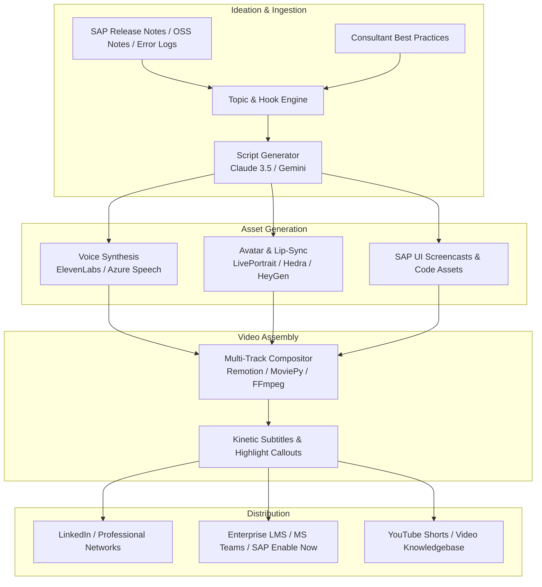

# Enterprise AI Microlearning Engine (SAP & B2B Edition)

> **Autonomous AI-SME (Subject Matter Expert) Pipeline for High-Retention Microlearning, LinkedIn Thought Leadership, and Enterprise Training.**

[](LICENSE)
[](https://www.python.org/downloads/)
[](docs/ARCHITECTURE.md)

---

## 💡 Executive Concept & Vision

Traditional enterprise software training (especially in complex ecosystems like **SAP S/4HANA, BTP, Fiori, and ABAP Cloud**) suffers from:
* **Information Overload:** 200-page dry PDF manuals, static documentation, and hour-long webinar recordings that employees and consultants rarely finish.
* **Slow Content Production:** High production costs for instructional designers, video editors, and on-camera subject matter experts.
* **Low Retention:** Lack of hook psychology and dynamic visual framing that drives modern knowledge retention.

### From "Faceless Influencer" to "Enterprise AI-SME"
Borrowing the viral mechanics of modern AI content pipelines (consistent character avatars, 3-second retention hooks, dynamic zoom cuts, kinetic typography), this engine redirects those mechanics toward **high-value B2B microlearning**:
* **60–90 second hyper-focused video nuggets** solving real enterprise pain points (e.g., debugging SAP error codes, Clean Core extensibility rules, Fiori UX shortcuts).
* **Consistent AI-SME Personas** acting as virtual corporate mentors (The Solution Architect, The Fiori Developer, The Supply Chain Specialist).
* **Multi-Layered Layout:** Combines talking AI avatars with split-screen SAP GUI/Fiori screencasts, annotated code blocks, and animated UI callouts.
* **Dual Distribution:**
  1. **External:** Automated publishing to LinkedIn, YouTube Shorts, and X for B2B consulting lead generation and thought leadership.
  2. **Internal:** Direct packaging into enterprise LMS (SCORM/xAPI), Microsoft Teams learning channels, and intranet onboarding hubs.

---

## 🏛️ System Architecture Overview



For the complete technical breakdown, see [docs/ARCHITECTURE.md](docs/ARCHITECTURE.md).

---

## 🎭 Persona Archetypes for Enterprise SAP

| Persona | Domain / Niche | Content Focus | Target Audience |
| :--- | :--- | :--- | :--- |
| **Marcus Vance** | SAP Enterprise Architect | S/4HANA Migration, Clean Core, BTP Architecture, Cloud Integration | CIOs, Enterprise Architects, IT Directors |
| **Elena Rostova** | Fiori & ABAP Cloud Dev | Fiori Elements, CDS Views, RAP (RESTful ABAP), VS Code extensions | Developers, Technical Consultants |
| **David Chen** | Supply Chain & Logistics | SAP MM, SD, EWM transaction tips, troubleshooting inventory blocks | Functional Consultants, Supply Chain Ops |

---

## 📂 Repository Structure

```
├── README.md                          # Project overview and executive vision
├── docs/
│   ├── ARCHITECTURE.md                # System architecture, schemas, and pipeline specs
│   ├── SAP_MICROLEARNING_STRATEGY.md  # Content framework, hook formulas, and topic roadmap
│   ├── TECH_STACK.md                  # Comprehensive tool and library choices
│   └── ROADMAP.md                     # Phased milestones from MVP to Enterprise Automation
├── configs/
│   ├── personas/                      # Persona voice, appearance, and prompt configs
│   │   ├── sap_architect.yaml
│   │   ├── fiori_dev.yaml
│   │   └── erp_functional_consultant.yaml
│   └── templates/                     # 60s microlearning script templates
│       └── bite_size_tip_60s.yaml
├── src/
│   ├── core/                          # Configuration and Pydantic data schemas
│   │   ├── config.py
│   │   └── models.py
│   ├── pipeline/                      # Core processing pipeline
│   │   ├── ideation.py                # Script and hook generation
│   │   ├── voice_engine.py            # ElevenLabs / TTS audio generator
│   │   ├── avatar_engine.py           # Avatar animation and lip-sync
│   │   └── compositor.py              # Multi-layer video compositor with captions
│   └── publishers/                    # Automated publishing modules
│       └── linkedin_publisher.py
├── samples/
│   └── sample_scripts/                # Production-ready test scripts
│       ├── 01_sap_m7021_inventory_error.md
│       └── 02_clean_core_extensibility_in_60s.md
├── requirements.txt
└── pyproject.toml
```

---

## 🚀 Quickstart

### Prerequisites
* Python 3.11+
* FFmpeg installed on system path (`brew install ffmpeg`)
* API Keys for LLM (Anthropic / Google Gemini) and Voice (ElevenLabs)

### Installation
```bash
# Clone the repository
git clone https://github.com/Moty/enterprise-ai-microlearning.git
cd enterprise-ai-microlearning

# Create virtual environment
python3 -m venv .venv
source .venv/bin/activate

# Install dependencies
pip install -r requirements.txt
```

### Configuration
Copy `.env.example` to `.env` and fill in your API credentials:
```bash
LLM_PROVIDER=anthropic            # or google
ANTHROPIC_API_KEY=your_key_here
ELEVENLABS_API_KEY=your_key_here
OUTPUT_DIR=./output
```

---

## 📄 License
This project is licensed under the MIT License - see the LICENSE file for details.
