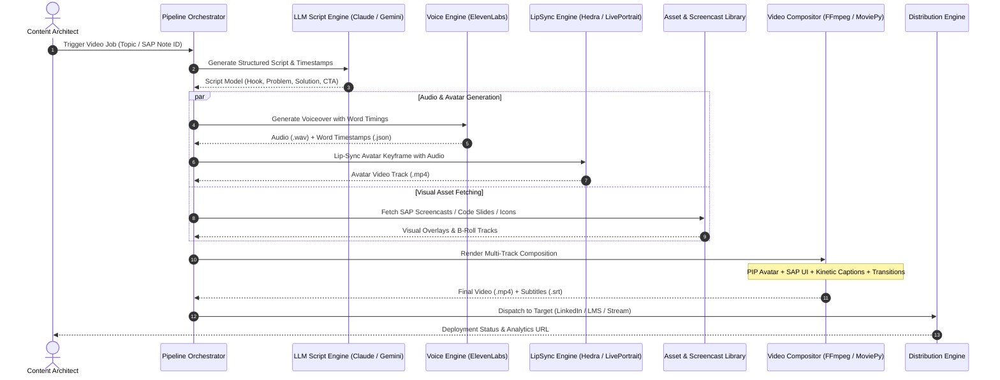

# Architecture Specification: Enterprise AI Microlearning Engine

## 1. System Overview

The **Enterprise AI Microlearning Engine** is an automated video production system engineered to turn raw enterprise documentation, SAP notes, code snippets, and business processes into high-retention, broadcast-quality microlearning videos (45–90 seconds) with consistent AI-SME presenters.



---

## 2. Core Subsystems

### Subsystem A: Script & Ideation Engine
* **Input Sources:**
  * SAP OSS Notes / Error codes (e.g. `M7021`, `VK01`, `SM21`).
  * Architecture Best Practice guides (SAP Clean Core, BTP Event Mesh, RAP framework).
  * Instructional prompt templates stored as YAML in `configs/templates/`.
* **Prompt Engineering Strategy:**
  * **0–3s Hook:** Disruption or relatable consultant pain point (*"If you still modify standard SAP tables in 2026, stop immediately."*).
  * **3–15s Problem & Consequence:** Why it breaks or causes high maintenance costs.
  * **15–50s Concrete 3-Step Fix:** High-density, step-by-step visual solution with transaction codes or CDS view syntax.
  * **50–60s CTA & Resource Drop:** Direct call to action (e.g., *"Download the Clean Core cheat sheet linked in the comments"*).

### Subsystem B: Voice & Phoneme Timing Subsystem
* **Engine:** ElevenLabs Speech Synthesis API / Azure Cognitive Speech.
* **Requirements:**
  * Natural cadence, proper pronunciation of technical terminology (e.g. *SAP* pronounced letter-by-letter *S-A-P*, *S/4HANA*, *ABAP*, *Fiori*, *BAPI*).
  * Word-level alignment timestamps extracted via alignment API to power kinetic subtitles and UI highlight sync.

### Subsystem C: Avatar & Lip-Sync Animation
* **Avatar Profiles:** Fixed character seeds generated via Flux.1 / Midjourney with consistent lighting, professional attire (business casual or tech corporate), and neutral background.
* **Animation Models:**
  * **LivePortrait / Hedra:** High-frame-rate realistic lip sync with natural head tilt, blinks, and micro-expressions.
  * **Transparent Alpha Matte:** Supports rendering avatar with transparent background or circular/rounded-square mask for Picture-in-Picture (PIP) overlay.

### Subsystem D: Visual Screencast & Asset Library
* **Asset Types:**
  1. **SAP GUI / Fiori Screencasts:** Standard transaction clips (recorded in high-DPI 4K).
  2. **Code Snippets:** Carbon-style syntax-highlighted ABAP / JavaScript / YAML code blocks.
  3. **Callout Annotations:** Bounding boxes, red arrows, and zoom-in focal points emphasizing specific fields in the SAP interface.

### Subsystem E: Multi-Track Video Compositor
* **Composition Layouts:**
  * **Layout 1: Split Screen (1080x1920 or 1080x1350 for LinkedIn):** Top 40% SAP UI / Code; Bottom 60% Avatar Presenter with kinetic text overlay.
  * **Layout 2: Picture-in-Picture (PIP):** Fullscreen SAP UI recording with a circular floating avatar bubble in bottom corner.
  * **Layout 3: Slide Presentation:** Dark corporate theme, high-contrast typography, and dynamic slide transitions.
* **Typography:** Bold sans-serif (Inter / Poppins), sentence-by-sentence word pop-ups with dynamic highlight colors (SAP blue `#0070F2`, gold `#F0AB00`).

---

## 3. Data Schema & Models

All pipeline jobs adhere to strict Pydantic schemas defined in `src/core/models.py`:

```python
class ScriptSection(BaseModel):
    section_type: Literal["hook", "problem", "solution", "cta"]
    voiceover_text: str
    visual_cue: str
    screen_asset_id: Optional[str] = None
    highlight_box: Optional[Dict[str, float]] = None

class VideoScript(BaseModel):
    topic: str
    target_persona_id: str
    duration_target_seconds: int = 60
    sections: List[ScriptSection]
    hashtags: List[str]
    linkedin_post_caption: str

class VideoRenderJob(BaseModel):
    job_id: str
    script: VideoScript
    output_format: Literal["linkedin_vertical", "linkedin_square", "lms_widescreen"]
    status: Literal["pending", "generating_audio", "animating", "compositing", "completed", "failed"]
    rendered_file_path: Optional[str] = None
```

---

## 4. Distribution & Deployment Targets

1. **LinkedIn Professional Pages / Personal Profiles:**
   * Video format: MP4 (H.264), 1080x1350 (4:5) or 1080x1920 (9:16).
   * Bundled with high-converting post copy, hashtags (`#SAP #S4HANA #CloudERP #BTP`), and first-comment resource links.
2. **Enterprise LMS & LXP:**
   * Bundled as SCORM 1.2 / 2004 or xAPI micro-modules.
   * Includes `.srt` / `.vtt` closed captions for enterprise accessibility compliance (WCAG 2.1 AA).
3. **Microsoft Stream & Internal Teams Channels:**
   * Automated webhook notification pushed to enterprise training channels on video completion.
