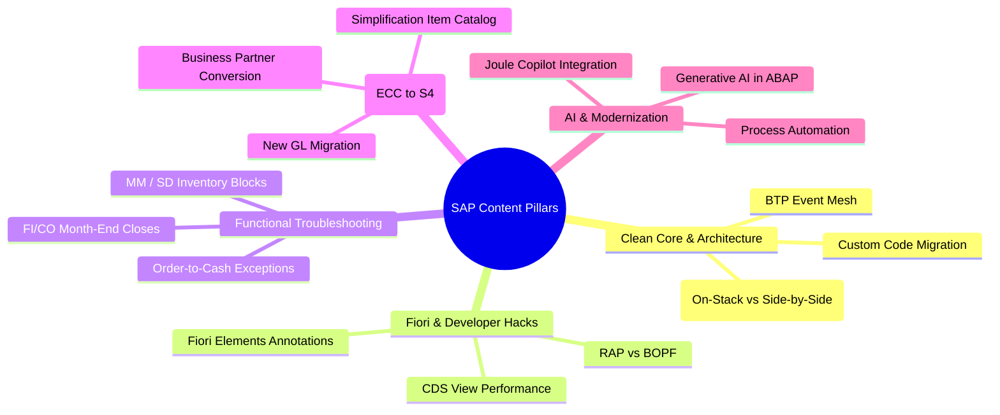

# SAP & Enterprise Microlearning Strategy Guide

## 1. Why Microlearning for SAP?

Enterprise software implementations (SAP S/4HANA, BTP, SuccessFactors, Ariba) fail or suffer huge delays largely due to **user adoption failure** and **knowledge silos**.
Traditional enablement relies on 8-hour classroom sessions or 150-page implementation manuals that consultants and business users dread.

By adapting viral short-form retention tactics (from platforms like TikTok/Shorts) to LinkedIn and corporate channels, we achieve:
* **High Information Density:** 1 core problem solved per 60-second video.
* **Immediate Applicability:** Users see the exact screen, transaction code, or line of code.
* **Daily Repetition & Top-of-Mind Brand:** Daily or tri-weekly posts establish the creator/consultancy as the definitive authority in the space.

---

## 2. The 5 Core Content Pillars for SAP Microlearning



---

## 3. High-Converting B2B LinkedIn Hook Formulas

Unlike consumer social media, corporate viewers on LinkedIn respond to **risk reduction**, **cost savings**, **career competence**, and **avoiding common blunders**.

### Formula 1: The "Expensive Mistake" Hook
* *"If your team is still building classic enhancements in S/4HANA, you are creating a technical debt nightmare. Here is how to fix it in 60 seconds."*
* *"The single most common mistake during S/4HANA Business Partner conversion (and how transaction `MDS_LOAD_COCKPIT` solves it)."*

### Formula 2: The "Hidden Shortcut" Hook
* *"Stop manually digging through SAP tables for purchase order history. Use this single Fiori search syntax instead."*
* *"90% of ABAP developers don't know this debugger feature exists in ADT (ABAP Development Tools)."*

### Formula 3: The "Architecture Disruption" Hook
* *"SAP just deprecated this classic interface. Here is the modern BTP alternative you need to implement before your next release."*
* *"Why Clean Core isn't just marketing hype: 3 rules your developers must follow starting today."*

---

## 4. 30-Day Content Matrix (Sample)

| Day | Topic | Persona | Format | Target KPI |
| :--- | :--- | :--- | :--- | :--- |
| **01** | Fixing SAP Error `M7021` (Deficit of Stock) | David (Logistics) | Screen + Avatar PIP | Shares by MM consultants |
| **02** | What is SAP Clean Core in 60 Seconds? | Marcus (Architect) | Split Screen + Diagrams | High executive reach & comments |
| **03** | Fiori Elements: Adding a Filter Bar with 3 Annotations | Elena (Fiori Dev) | Code Highlight + Avatar | Saves by technical devs |
| **04** | ECC vs S/4HANA: The 3 biggest architectural differences | Marcus (Architect) | Carousel-style video | Profile views & connections |
| **05** | Debugging RFC connection drops in SM59 | Elena (Fiori Dev) | Screen capture + fix | Technical saves |
| **...** | ... | ... | ... | ... |

---

## 5. Monetization & ROI Funnel

```
[60s LinkedIn Video] 
        │
        ▼ (High engagement & authority)
[First Comment Lead Magnet] (e.g., "Get the free 5-page S/4HANA Clean Core Checklist")
        │
        ▼ (Email opt-in via Beehiiv/ConvertKit)
[Consulting Funnel / Corporate Workshop]
        │
        ├── $5,000 - $25,000 Corporate Microlearning & Enablement Subscription
        └── $50,000+ S/4HANA Migration & Clean Core Advisory Engagements
```
